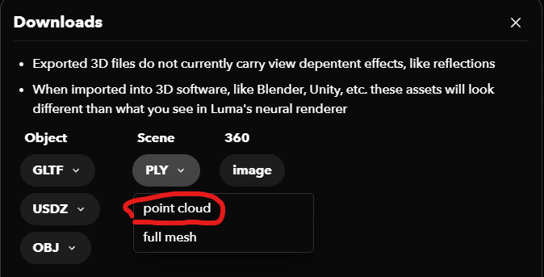

# Final Project

## Installation

### Prerequisite

- Hardware:
    - This project takes approximately 1.8G graphic memory and 3.2G memory
    - Frame rate on RTX A6000 (Sever connected using SSH X11, which might harm the framerate)
        - Instant-NGP (volume rendering): 10 - 20
        - Object mesh (vertex based): 25
    - Frame rate on RTX 3060 (Local machine)
        - Instant-NGP (volume rendering): 7 - 10
        - Object mesh (vertex based): 50
- Cuda (This project is coded in an environment with cuda 11.8)
- Python
    - version: 3.10
- Anaconda ( \[optional\] \[Python environment management\] )
    - Install anaconda:
        - Download: https://www.anaconda.com/download
        - Docs for installation: https://docs.anaconda.com/free/anaconda/install/
    - Enable anaconda commands
        - Linux: Done automatically after installation
        - Windows: Find and open installed `Anaconda Prompt`
    - Create environment
        - `conda create -n graphics python=3.10` and follow the prompt
    - Activate environment
        - `conda activate graphics`
- PyTorch
    - Current version: 2.1.1
    - Install:
        - Link: https://pytorch.org/get-started/locally/
        - In this link, select the preferences and run the command provided in the table
          
        - *The command will be different if PyTorch is installed without conda. Make sure to use the exact command generated
          by the website*

### Project Install

- Download project
    - `git clone https://github.com/YY-OhioU/GraphicsFinalProject.git`
- Enter project root
    - `cd GraphicsFinalProject`
- Install dependencies:
    - `pip install -r requirements`
- Decompress neural network model
    - Compressed model is in the `models` folder under the project root
    - Find `model.zip` then unzip it. Place extracted file `model.pth` under `models` folder
    - `cd models && unzip model.zip`

### Run project:

``` shell
cd GraphicsFinalProject/
python main.py
```

## Render Your Own Video

- **Replace model.pth**
    - NeRF model is trained with `TaiChi NeRFs`
    - Find their GitHub repo and follow the instruction under section `Train with your own video`
        - Might need some extra work (for ffmpeg and colmap)
        - Their `train_from_video.sh` script is very helpful for solving the problems. Could run the commands in this
          script separately (How I get the model: Run `colmap2nerf.py` in `data` folder to get dataset and run `train.py`
          to train)
    - After training, find `model.pth` in the generated `results` folder
    - Copy the `model.pth` from `TaiChi NeRFs` project to this project and put the model file under `models` folder
- **Replace `point_cloud.pkl`**
  - Remove the old `point_cloud.pkl` (rm or rename to something else)
  - Get point cloud model
    - Upload video to Luma Ai: https://lumalabs.ai/
    - Download the scene as point cloud in .ply format
    
    - Place the downloaded .ply model under `models` folder, and rename it to `point_cloud.ply`
  - Convert the model to binary file
    - This step is to enable the project to load the point cloud faster
    - run `python tools/ply2numpy.py`
- **Run `main.py`**